##### TODO !!!
1. Make the automation of EFI delivery to a disk or flash drive partition a script 
2. Describe folder Folder-Win10-to-EFI-partition

# ASUS PRIME B360M-A - i3 9100F - RX580 - HACKINTOSH

[RUS](https://github.com/merelyigor/Asus-Prime-B360M-A_i3-9100F_RX580/blob/master/README_RU.MD) / ENG

[Clover Version (Release v5.0): r5115](https://github.com/CloverHackyColor/CloverBootloader/releases/tag/5115)

[MacOS version : 10.15.3 (19D76) should also work for 10.15.x](https://www.apple.com/macos/catalina/)

[Closed repo with a mine personal config](https://github.com/merelyigor/Asus-Prime-B360M-A_i3-9100F_RX580_config_plist) only for me

[Open repo with script for automatic delivery of EFI to disk](https://github.com/merelyigor/Script-install-EFI-B360M-A_i3-9100F_RX580)

## What Works
Everything

## Configuration

| Components  | Mine | Possibly Compatible |
| ------------- | ------------- | ------------- |
| Motherbaord  | [ASUS PRIME B360M-A](https://www.asus.com/Motherboards/PRIME-B360M-A/)  | ASUS PRIME [B360M-K](https://www.asus.com/Motherboards/PRIME-B360M-K/) [B360M-D](https://www.asus.com/Motherboards/PRIME-B360M-D) [B360M-C](https://www.asus.com/Motherboards/PRIME-B360M-C) [B360M-A-CSM](https://www.asus.com/Motherboards/PRIME-B360M-A-CSM)  |
| CPU  | [Intel® Core™ i3-9100F (no integrated graphics)](https://ark.intel.com/content/www/us/en/ark/products/190886/intel-core-i3-9100f-processor-6m-cache-up-to-4-20-ghz.html)  | Any Intel Core™ [i3/](https://ark.intel.com/content/www/us/en/ark/products/series/134901/9th-generation-intel-core-i3-processors.html)[i5/](https://ark.intel.com/content/www/us/en/ark/products/series/134902/9th-generation-intel-core-i5-processors.html)[i7](https://www.intel.com/content/www/us/en/support/products/134907/processors/intel-core-processors/9th-generation-intel-core-i7-processors.html) 9th OR [i3/](https://ark.intel.com/content/www/ru/ru/ark/products/series/122588/8th-generation-intel-core-i3-processors.html)[i5/](https://ark.intel.com/content/www/us/en/ark/products/series/122597/8th-generation-intel-core-i5-processors.html)[i7](https://ark.intel.com/content/www/us/en/ark/products/series/122593/8th-generation-intel-core-i7-processors.html) 8th Generation with or without integrated graphics |
| RAM  | [DDR4 2400 16GB (1x16GB)](https://www.moyo.ua/pamyat_dlya_pk_micron_crucial_ddr4_2400_16gb_retail_ct16g4dfd824a/328726.html) | Any DDR4 which is supported by the processor and motherboard |
| GPU  | [Sapphire RX580 Pulse 8Gb](https://www.sapphiretech.com/en/consumer/pulse-rx-580-8g-g5) (iGPU disabled in BIOS or not available)  | RX 560, 570, 580, 590 , VEGA56, VEGA64, 5500 XT, 5600, 5600 XT, 5700, 5700 XT, Radeon VII  |
| SMBIOS  | iMacPro1,1  | iMacPro1,1  |

## References to used [(.kext)](http://www.macbreaker.com/2012/01/what-are-kexts.html)
Located in the repository along the way Folder-MacOS-to-clover-partition/EFI/CLOVER/kexts/Other/*
###### Links and titles
1. [AppleALC.kext](https://github.com/acidanthera/applealc/releases)
2. [Lilu.kext](https://github.com/acidanthera/lilu/releases)
3. [RealtekRTL8111.kext](https://github.com/Mieze/RTL8111_driver_for_OS_X/releases)
4. [VirtualSMC.kext / SMCSuperIO.kext / SMCProcessor.kext](https://github.com/acidanthera/virtualsmc/releases)
5. [USBInjectAll.kext](https://bitbucket.org/RehabMan/os-x-usb-inject-all/downloads/)
6. [WhateverGreen.kext](https://github.com/acidanthera/whatevergreen/releases)
###### You can also update using the program (Kext Updater) but how to do it look in google
###### Using the links above you can download the releases and replace them in the folder where they are with me Folder-MacOS-to-clover-partition/EFI/CLOVER/kexts/Other/* 

## Instructions for MacOS version : 10.15.3
In order to configure the config.plist file you need any poppy or its virtual image on the windows
It is also advisable to update the driver [(.kext)](http://www.macbreaker.com/2012/01/what-are-kexts.html) in folder EFI/CLOVER/kexts/Other/*
References to used [(.kext)](http://www.macbreaker.com/2012/01/what-are-kexts.html) are described above

1. Download this
   - The EFI folder from [this repo](https://github.com/merelyigor/Asus-Prime-B360M-A_i3-9100F_RX580_last_MacOS) is in Folder-MacOS-to-clover-partition/.
   - [PlistEdit Pro](https://www.fatcatsoftware.com/plisteditpro/)
   - [Clover Configurator](https://mackie100projects.altervista.org/download-clover-configurator/)

2. Go to EFI/CLOVER/config.plist and open it with [PlistEdit Pro](https://www.fatcatsoftware.com/plisteditpro/)

3. Open Clover Configurator and go to the tab (1)SMBIOS > (2) choose Mac model iMacPro1,1
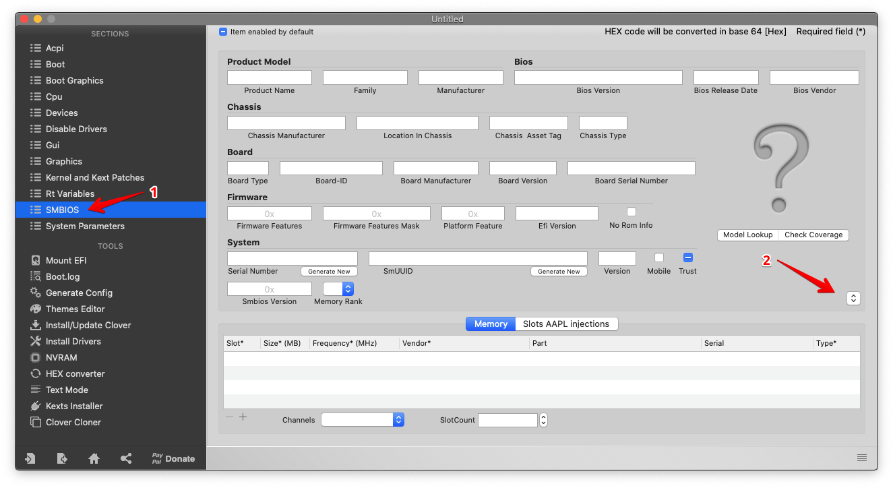

4. Press a random number of times on the buttons in any order (Generate New)
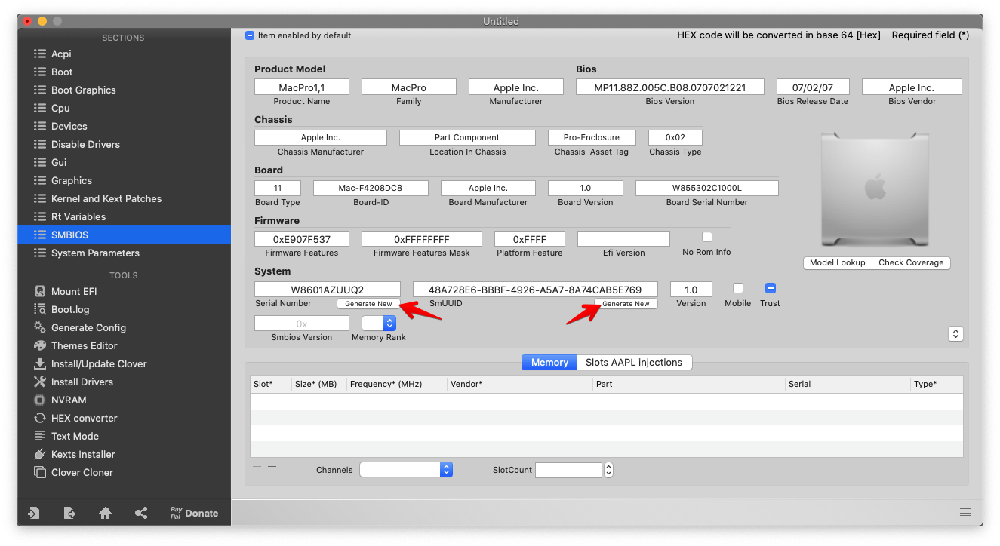

5. Go to the tab (1)Rt Variables > (2) choose UseMacAddr0
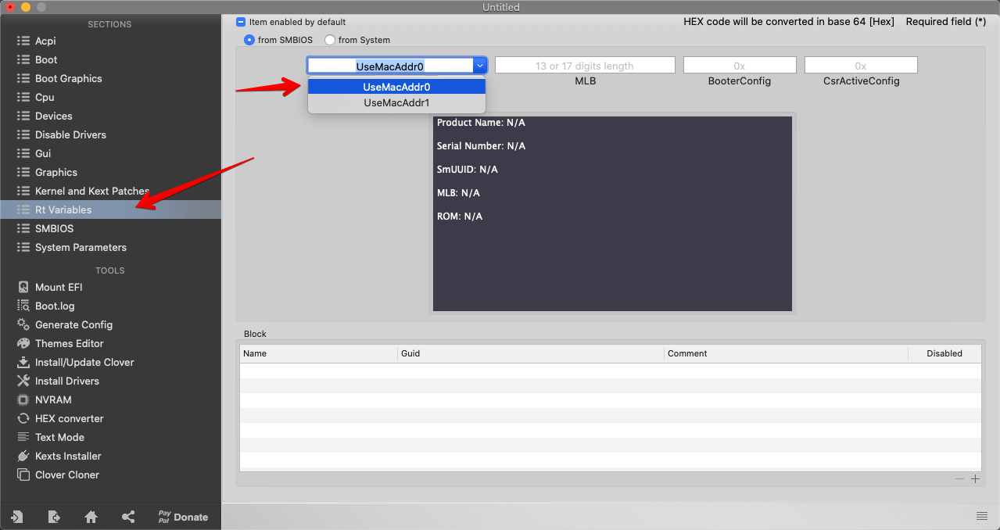
then also a random number of times click below on the Generate button

6. After all the steps you need to transfer the data to config.plist according to this scheme via [PlistEdit Pro](https://www.fatcatsoftware.com/plisteditpro/)
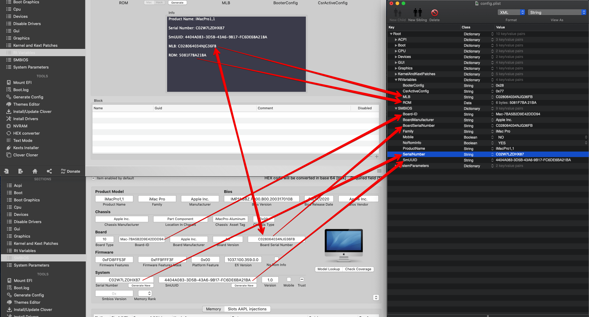

7. Copy the EFI folder to the root of the EFI partition. (delete everything else in your EFI section before doing this)

5. Save and reload.

## BIOS settings
###### Mandatory settings (all settings are made in UEFI Advance Mode press F7 to switch in UEFI Advance Mode)
###### Mandatory before all settings to reset the BIOS to default settings
| Where is | Settings | Default | Need |
| ------------- | ------------- | ------------- | ------------- |
| Advanced\PCH Storage Configuration | SATA Mode Selection | ??? | AHCI |
| Ai Tweaker\Internal CPU Power Management | Intel(R) SpeedStep(tm) | Auto | Enabled |
| Advanced\System Agent (SA) Configuration | Above 4G Decoding | Disabled | Enabled |
| Advanced\Onboard Devices Configuration | Serial Port | Enabled | Disabled |
| Advanced\Onboard Devices Configuration | Parallel Port | Enabled | Disabled |
| Advanced\USB Configuration | XHCI Hand-off | Disabled | Enabled |
| Boot\Boot Configuration | Fast Boot | Enabled | Disabled |
| Advanced\PCH Configuration | System Time and Alarm Source | ACPI Time and Alarm Device | Legacy RTC |
| Advanced\CPU Configuration | CFG Lock | ??? | Disabled |
| Boot\Secure Boot | OS Type | ??? | Other OS |

###### optional

| Where is | Settings | Default | Need |
| ------------- | ------------- | ------------- | ------------- |
| Advanced\CPU Configuration | Intel (VMX) Virtualization Technology | ??? | Enabled |
| Boot\Boot Configuration | Boot Logo Display | Auto | Disabled |
| Boot\Boot Configuration | POST Report | 5 sec | 1 sec |
| Boot\Boot Configuration | Setup Mode | EZ Mode | Advanced Mode |
| Boot\ | CMS Compatibility Support Module | ??? | ( Enabled \ Only UEFI or UEFI First ) or Disable CMS |

[Screenshots with my settings here](https://github.com/merelyigor/Asus-Prime-B360M-A_i3-9100F_RX580/blob/master/screenshots.md)

### OFFTOP
For those in Ukraine where I bought a motherboard, processor, etc.
1. [Motherboard Asus Prime B360M-A (s1151, Intel B360, PCI-Ex16)](https://hard.rozetka.com.ua/asus_prime_b360m_a/p36702976/)
2. [Processor Intel Core i3-9100F 3.6GHz/8GT/s/6MB (BX80684I39100F) s1151 BOX](https://hard.rozetka.com.ua/intel_core_i3_9100f/p87431722/)
3. [RAM Micron Crucial DDR4 2400 16GB Retail (CT16G4DFD824A)](https://www.moyo.ua/pamyat_dlya_pk_micron_crucial_ddr4_2400_16gb_retail_ct16g4dfd824a/328726.html)
4. [Chieftec 600W CFT-600-14CS 600Watt](https://www.olx.ua/list/q-Chieftec-600W/) Chieftec only:)
5. [Sapphire RX580 Pulse 8Gb](https://www.olx.ua/list/q-Sapphire-RX580-Pulse-8Gb/) They became very cheaper after the decline of mining
6. [housing Cougar MX330-G Black](https://hard.rozetka.com.ua/cougar_385nc10_0007/p38634720/)
7. [Cooler Arctic P12 Black (ACFAN00118A) 1x3](https://hard.rozetka.com.ua/arctic_acfan00118a/p177657439/)
8. [Cooler be quiet! Pure Wings 2 120mm (BL046) 1x2](https://hard.rozetka.com.ua/be_quiet_bl046/p3939710/)
9. [USB Bluetooth CSR 4.0 on a chip CSR8510](https://www.olx.ua/list/q-CSR-4.0/) also available in [stores](https://rozetka.com.ua/158247615/p158247615/) or [aliexpress](https://aliexpress.ru/wholesale?SearchText=CSR+4.0), the main thing is that the [chip matches (CSR8510)](https://www.qualcomm.com/products/csr8510)

    
    

#### Some screenshots of the system and benchmarks
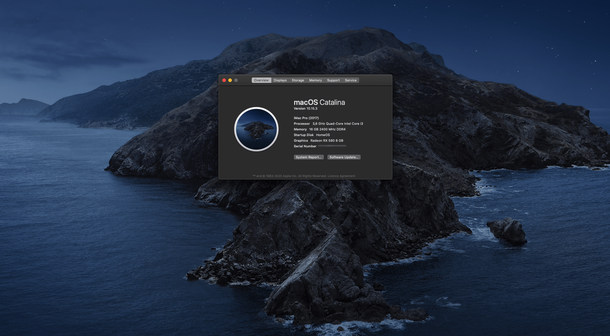

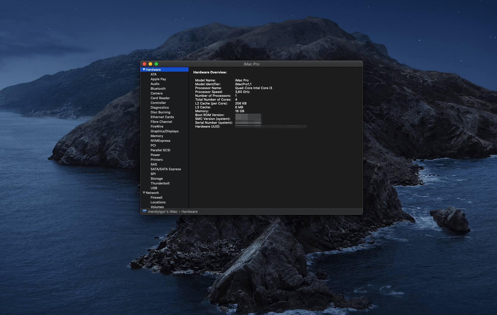

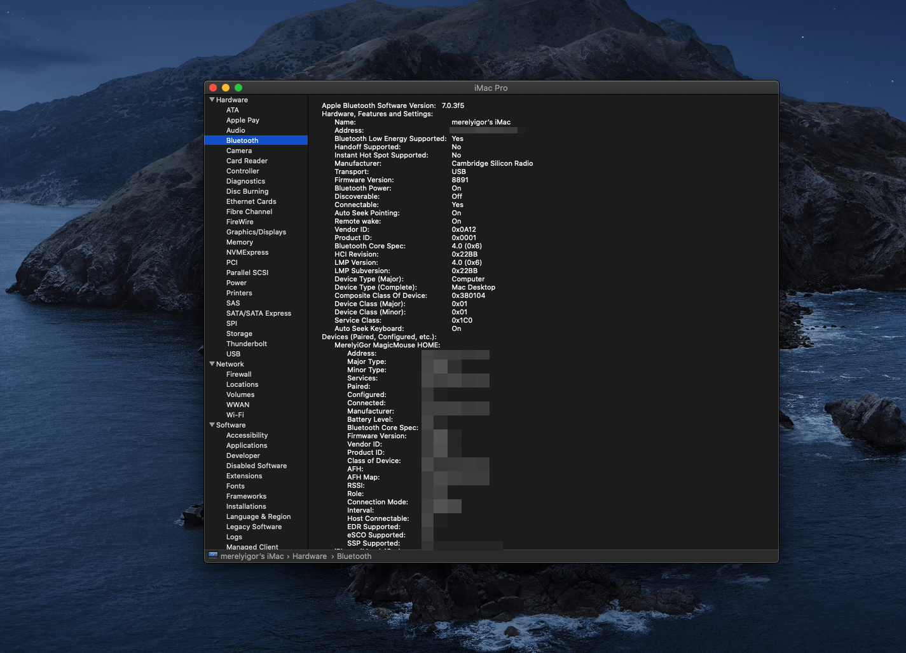

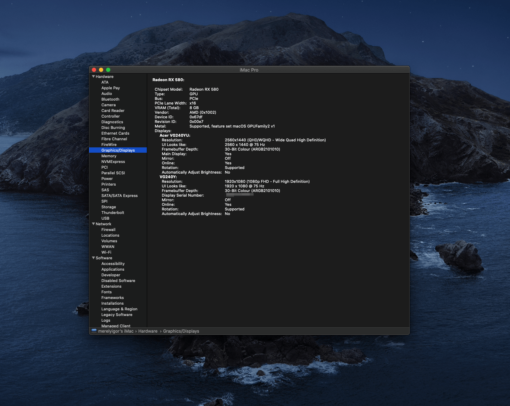

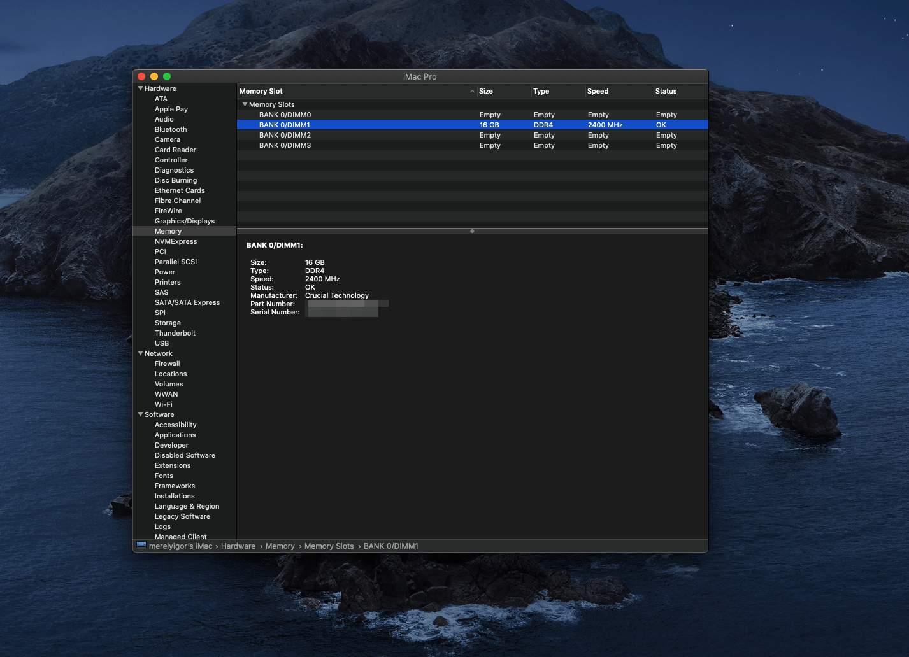

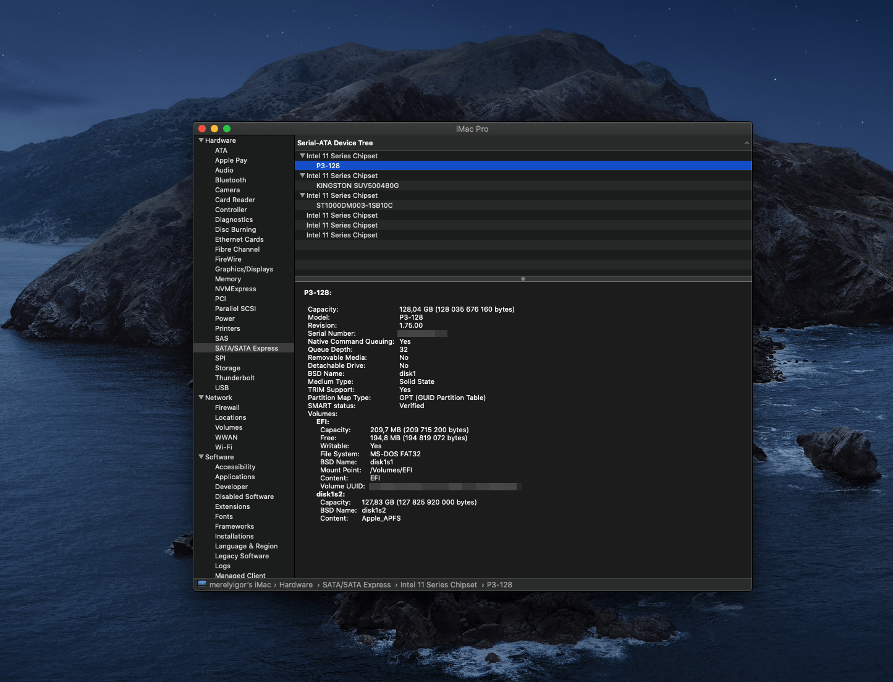

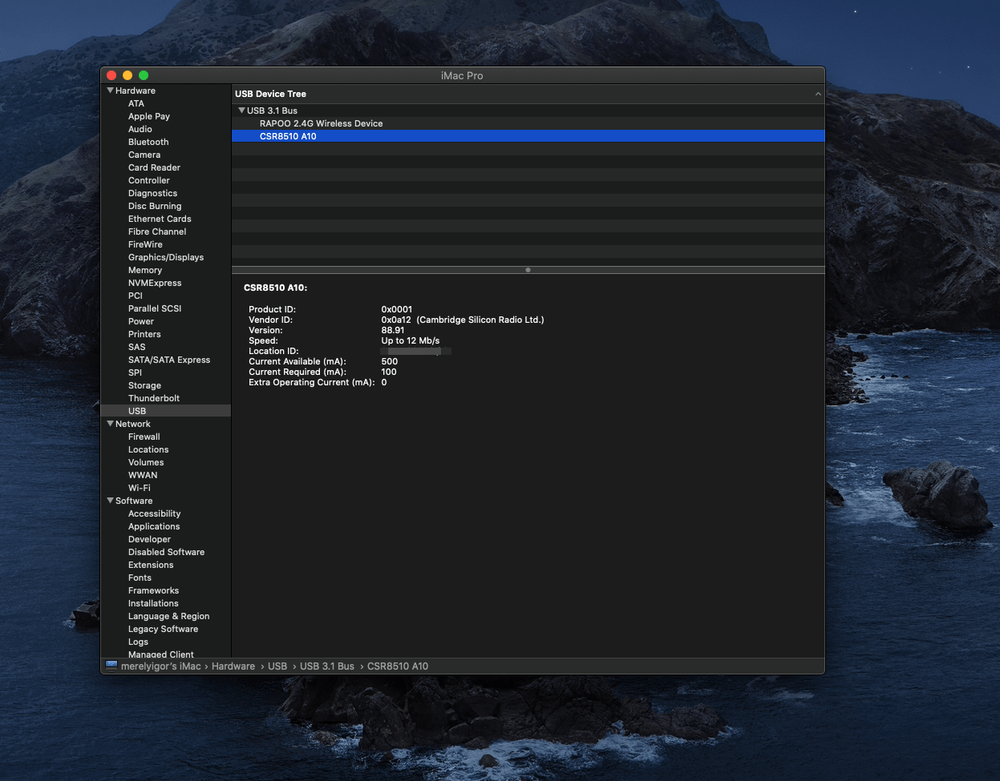

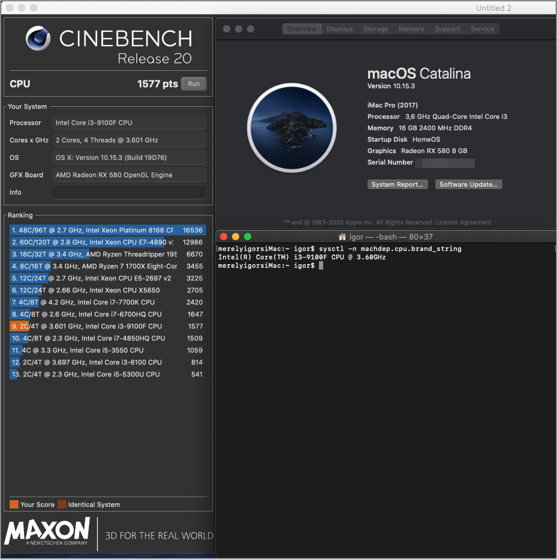

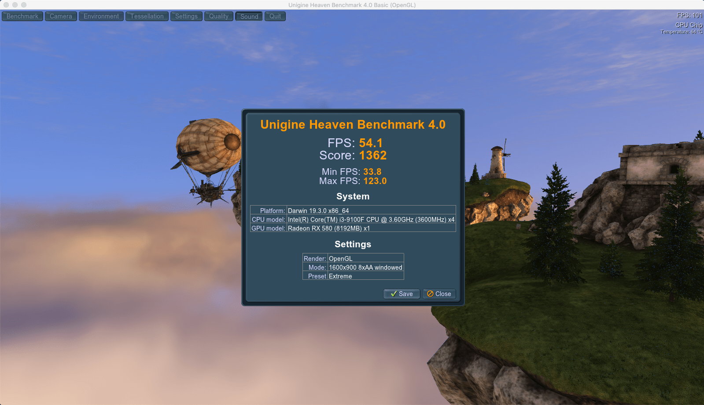

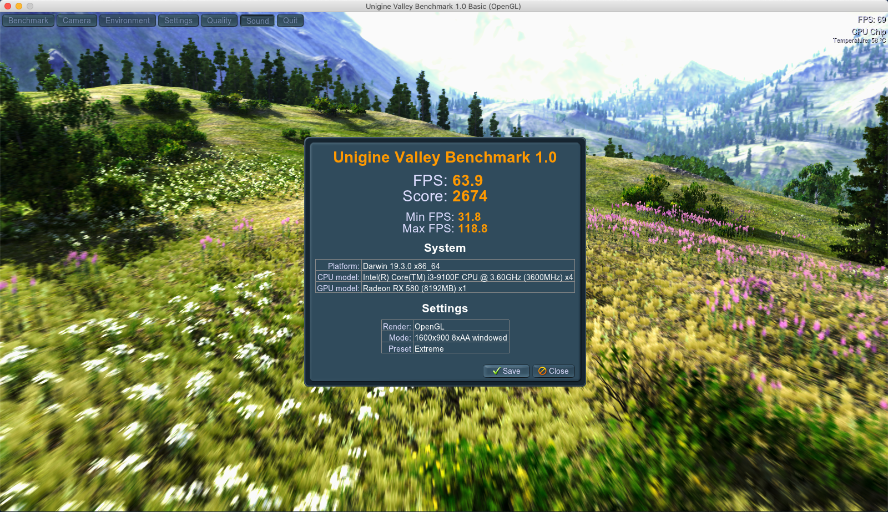

##### You can contact me through the contacts on my site [blog.eremenko.top](https://blog.eremenko.top/)
