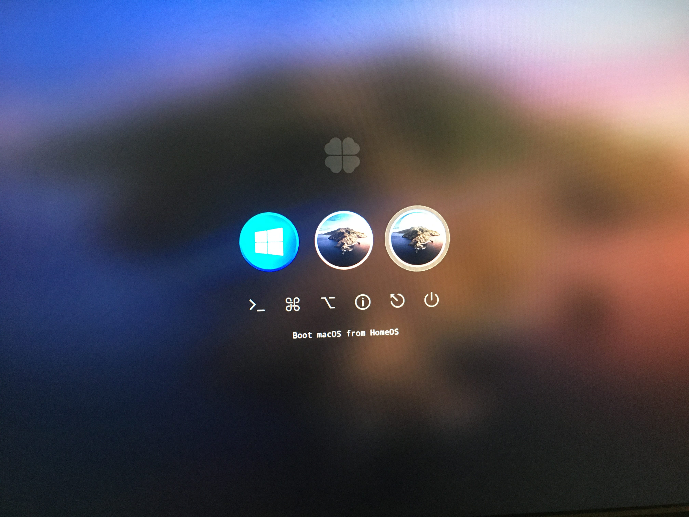

##### TODO !!!
1. Сделать сценарий автоматизации доставки EFI на раздел диска или флешки
2. Опишите папку Folder-Win10-to-EFI-partition

# ASUS PRIME B360M-A - i3 9100F - RX580 - HACKINTOSH

[ENG](https://github.com/merelyigor/Asus-Prime-B360M-A_i3-9100F_RX580) / RUS

[Clover Version (Release v5.0): r5115](https://github.com/CloverHackyColor/CloverBootloader/releases/tag/5115)

[MacOS version : 10.15.3 (19D76) should also work for 10.15.x](https://www.apple.com/macos/catalina/)

[Закрытое репо с моим личным конфигом](https://github.com/merelyigor/Asus-Prime-B360M-A_i3-9100F_RX580_config_plist) только для меня

[Открытое репо со скриптом для автоматической загрузки EFI на диск](https://github.com/merelyigor/Script-install-EFI-B360M-A_i3-9100F_RX580)

## Что работает
Все)

## Конфигурация

| Компоненты  | Моё | Возможно совместимо |
| ------------- | ------------- | ------------- |
| Материнская плата  | [ASUS PRIME B360M-A](https://www.asus.com/Motherboards/PRIME-B360M-A/)  | ASUS PRIME [B360M-K](https://www.asus.com/Motherboards/PRIME-B360M-K/) [B360M-D](https://www.asus.com/Motherboards/PRIME-B360M-D) [B360M-C](https://www.asus.com/Motherboards/PRIME-B360M-C) [B360M-A-CSM](https://www.asus.com/Motherboards/PRIME-B360M-A-CSM)  |
| Процессор  | [Intel® Core™ i3-9100F (без встроенной графики)](https://ark.intel.com/content/www/us/en/ark/products/190886/intel-core-i3-9100f-processor-6m-cache-up-to-4-20-ghz.html)  | Любой Intel Core™ [i3/](https://ark.intel.com/content/www/us/en/ark/products/series/134901/9th-generation-intel-core-i3-processors.html)[i5/](https://ark.intel.com/content/www/us/en/ark/products/series/134902/9th-generation-intel-core-i5-processors.html)[i7](https://www.intel.com/content/www/us/en/support/products/134907/processors/intel-core-processors/9th-generation-intel-core-i7-processors.html) 9th или [i3/](https://ark.intel.com/content/www/ru/ru/ark/products/series/122588/8th-generation-intel-core-i3-processors.html)[i5/](https://ark.intel.com/content/www/us/en/ark/products/series/122597/8th-generation-intel-core-i5-processors.html)[i7](https://ark.intel.com/content/www/us/en/ark/products/series/122593/8th-generation-intel-core-i7-processors.html) 8th Поколение с или без встроенной графики |
| Оперативная память  | [DDR4 2400 16GB (1x16GB)](https://www.moyo.ua/pamyat_dlya_pk_micron_crucial_ddr4_2400_16gb_retail_ct16g4dfd824a/328726.html) | Любой модуль DDR4 который поддерживается процессором и материнской платой |
| Видеокарта  | [Sapphire RX580 Pulse 8Gb](https://www.sapphiretech.com/en/consumer/pulse-rx-580-8g-g5) (iGPU отключен в биосе или его нет в процессоре)  | RX 560, 570, 580, 590 , VEGA56, VEGA64, 5500 XT, 5600, 5600 XT, 5700, 5700 XT, Radeon VII  |
| Маскировка под Мак  | iMacPro1,1  | iMacPro1,1  |

## Ссылки на используемые [(.kext)](http://www.macbreaker.com/2012/01/what-are-kexts.html)
Находится в репо по пути Folder-MacOS-to-clover-partition/EFI/CLOVER/kexts/Other/*
###### Ссылки и названия
1. [AppleALC.kext](https://github.com/acidanthera/applealc/releases)
2. [Lilu.kext](https://github.com/acidanthera/lilu/releases)
3. [RealtekRTL8111.kext](https://github.com/Mieze/RTL8111_driver_for_OS_X/releases)
4. [VirtualSMC.kext / SMCSuperIO.kext / SMCProcessor.kext](https://github.com/acidanthera/virtualsmc/releases)
5. [USBInjectAll.kext](https://bitbucket.org/RehabMan/os-x-usb-inject-all/downloads/)
6. [WhateverGreen.kext](https://github.com/acidanthera/whatevergreen/releases)
###### Вы также можете обновить с помощью программы (Kext Updater), но как это сделать, посмотрите в Google
###### Используя ссылки выше, вы можете скачать релизы и заменить их в папке, где они находятся у меня Folder-MacOS-to-clover-partition/EFI/CLOVER/kexts/Other/* 

## Инструкция для MacOS версии : 10.15.3
Для того чтобы настроить файл config.plist, вам понадобится любой MacOS или его виртуальный образ на Window.
Также желательно обновить драйвера [(.kext)](http://www.macbreaker.com/2012/01/what-are-kexts.html) в папке EFI/CLOVER/kexts/Other/*
Ссылки на используемые [(.kext)](http://www.macbreaker.com/2012/01/what-are-kexts.html) описаны выше

1. Скачать это
   - Папка EFI из [это репо](https://github.com/merelyigor/Asus-Prime-B360M-A_i3-9100F_RX580_last_MacOS) в Folder-MacOS-to-clover-partition/.
   - [PlistEdit Pro](https://www.fatcatsoftware.com/plisteditpro/)
   - [Clover Configurator](https://mackie100projects.altervista.org/download-clover-configurator/)

2. Перейдите в EFI/CLOVER/config.plist и откройте его [PlistEdit Pro](https://www.fatcatsoftware.com/plisteditpro/)

3. Откройте Clover Configurator и перейдите на вкладку (1)SMBIOS > (2)выберите модель Mac iMacPro1,1

4. Нажмите произвольное количество раз на кнопки в любом порядке (Generate New)

5. Перейти на вкладку (1)Rt Variables > (2) choose UseMacAddr0

затем также случайное количество раз нажмите ниже на кнопку Generate

6. После всех шагов вам нужно перенести данные в config.plist по этой схеме с помощью [PlistEdit Pro](https://www.fatcatsoftware.com/plisteditpro/)

7. Скопируйте папку EFI в корень раздела EFI. (удалите все остальное в вашем разделе EFI, прежде чем делать это)

5. Сохранить и перезагрузить.

## Настройки BIOS
###### Обязательные настройки (все настройки производятся в UEFI Advance Mode нажмите F7 для пережода в UEFI Advance Mode)
###### Обязательные перед всеми настройками сбросить настройки BIOS к настройкам по умолчанию
| Где находится | Настройка | Выставлено по умолчанию | Нужно поставить |
| ------------- | ------------- | ------------- | ------------- |
| Advanced\PCH Storage Configuration | SATA Mode Selection | ??? | AHCI |
| Ai Tweaker\Internal CPU Power Management | Intel(R) SpeedStep(tm) | Auto | Enabled |
| Advanced\System Agent (SA) Configuration | Above 4G Decoding | Disabled | Enabled |
| Advanced\Onboard Devices Configuration | Serial Port | Enabled | Disabled |
| Advanced\Onboard Devices Configuration | Parallel Port | Enabled | Disabled |
| Advanced\USB Configuration | XHCI Hand-off | Disabled | Enabled |
| Boot\Boot Configuration | Fast Boot | Enabled | Disabled |
| Advanced\PCH Configuration | System Time and Alarm Source | ACPI Time and Alarm Device | Legacy RTC |
| Advanced\CPU Configuration | CFG Lock | ??? | Disabled |
| Boot\Secure Boot | OS Type | ??? | Other OS |

###### По желанию

| Где находится | Настройка | Выставлено по умолчанию | Нужно поставить |
| ------------- | ------------- | ------------- | ------------- |
| Advanced\CPU Configuration | Intel (VMX) Virtualization Technology | ??? | Enabled |
| Boot\Boot Configuration | Boot Logo Display | Auto | Disabled |
| Boot\Boot Configuration | POST Report | 5 sec | 1 sec |
| Boot\Boot Configuration | Setup Mode | EZ Mode | Advanced Mode |
| Boot\ | CMS Compatibility Support Module | ??? | ( Enabled \ Only UEFI or UEFI First ) or Disable CMS |

[Cкриншоты с моими настройками тут](https://github.com/merelyigor/Asus-Prime-B360M-A_i3-9100F_RX580/blob/master/screenshots.md)

### OFFTOP
Для тех в Украине, где я купил материнскую плату, процессор и тд.
1. [Motherboard Asus Prime B360M-A (s1151, Intel B360, PCI-Ex16)](https://hard.rozetka.com.ua/asus_prime_b360m_a/p36702976/)
2. [Processor Intel Core i3-9100F 3.6GHz/8GT/s/6MB (BX80684I39100F) s1151 BOX](https://hard.rozetka.com.ua/intel_core_i3_9100f/p87431722/)
3. [RAM Micron Crucial DDR4 2400 16GB Retail (CT16G4DFD824A)](https://www.moyo.ua/pamyat_dlya_pk_micron_crucial_ddr4_2400_16gb_retail_ct16g4dfd824a/328726.html)
4. [Chieftec 600W CFT-600-14CS 600Watt](https://www.olx.ua/list/q-Chieftec-600W/) Только Chieftec:)
5. [Sapphire RX580 Pulse 8Gb](https://www.olx.ua/list/q-Sapphire-RX580-Pulse-8Gb/) Они стали очень дешевыми после падения Майнинга
6. [housing Cougar MX330-G Black](https://hard.rozetka.com.ua/cougar_385nc10_0007/p38634720/)
7. [Cooler Arctic P12 Black (ACFAN00118A) 1x3](https://hard.rozetka.com.ua/arctic_acfan00118a/p177657439/)
8. [Cooler be quiet! Pure Wings 2 120mm (BL046) 1x2](https://hard.rozetka.com.ua/be_quiet_bl046/p3939710/)
9. [USB Bluetooth CSR 4.0 on a chip CSR8510](https://www.olx.ua/list/q-CSR-4.0/) также доступно в [магазинах](https://rozetka.com.ua/158247615/p158247615/) или [aliexpress](https://aliexpress.ru/wholesale?SearchText=CSR+4.0), главное, что бы [чип совпадал с (CSR8510)](https://www.qualcomm.com/products/csr8510)

    
    

### Несколько скриншотов системы и бенчмарки

##### Вы можете связаться со мной через контакты на моем сайте [blog.eremenko.top](https://blog.eremenko.top/)
